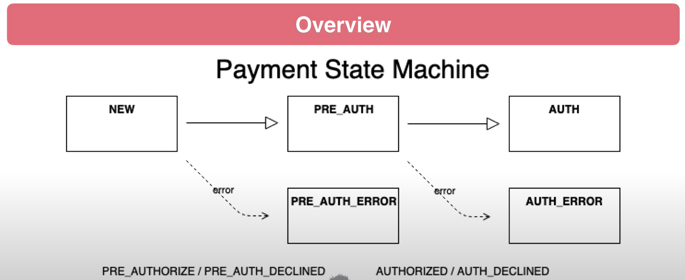

# Aperçu du traitement des cartes de crédit

Dans le traitement des cartes de crédit, chez certains fournisseurs, on a la possibilité de pré-autoriser un débit.  
Exemple : achat de gaz
* Carte magnétique - des frais de pré-autorisation ont lieu
* Valide la carte, place les fonds en retenue
* Pompe à gaz
* Carte de paiement avec montant réel de la vente

**Explication** :  
comme pour acheter de l'essence, on saisit le code de la carte pour autoriser un prélèvement (avec ou sans frais) avec un montant max définit par la borne,
on prend l'essence, et on obtient un vrai prix égal ou moins que le montant max, c'est après toutes ces étapes qu'on est vraiment débité.

## Penser en termes de States
* Le paiement par carte de crédit aura les états suivants :
  * Nouveau - nouveau paiement
  * Pré-autorisé - Charge pré-autorisée par le processeur 
  * Erreur de pré-autorisation - Pré-autorisation rejetée par le processeur
  * Autorisé - Charge approuvée par le processeur
  * Erreur d'autorisation - Frais rejetés par le processeur

## Penser en termes événements
* Événements de traitement des cartes de crédit :
  * Frais de pré-autorisation - Processeur d'appel pour la transaction de pré-autorisation
  * Pré-autorisation approuvée - Le processeur a approuvé la pré-autorisation
  * Pré-autorisation refusée - Le processeur a refusé la pré-autorisation
  * Autoriser la facturation - Appelez le processeur pour obtenir une autorisation de facturation
  * Autorisation approuvée - Le processeur a approuvé la facturation
  * Autorisation refusée – Le processeur a rejeté la facturation

